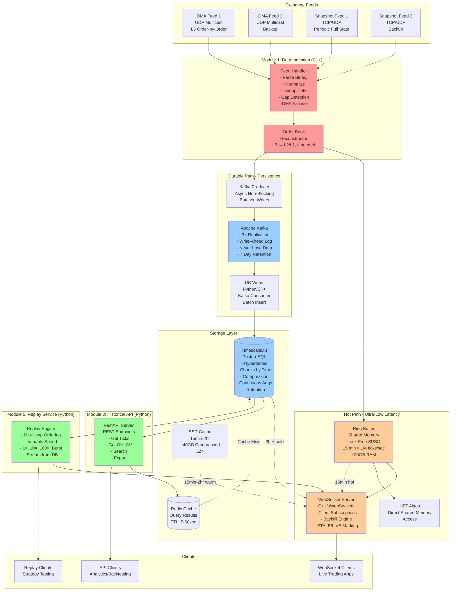

# Market Data Platform - Complete System Architecture

## Overview

This document describes the complete architecture of a high-performance Market Data Platform for Indian equities and options. The system ingests real-time market data from exchange feeds, persists it durably, provides historical access, and enables replay for backtesting.

**Design Philosophy**: Hot path (C++) for speed, Cold path (Python) for flexibility.

---

## System Architecture Diagram



---

## Complete System Flow

### 1. **Data Ingestion (Module 1) - C++**

**Input**: DMA L3 feeds (2×), Snapshot feeds (2×) via UDP Multicast

**Process**:
1. Feed Handler receives binary packets from exchange
2. Parse protocol-specific format (NSE/BSE binary)
3. Normalize to unified internal format
4. Deduplicate using sequence number bitmap
5. Detect gaps (missing sequence numbers)
6. Request retransmission via TCP if gap found
7. Reconstruct Order Book from L3 tick-by-tick data
8. DMA failover: Switch to backup if primary unhealthy

**Output**: 
- Normalized market events → Ring Buffer (hot path)
- Normalized market events → Kafka Producer (durable path)

**Key Design Decisions**:
- **C++ for hot path**: Sub-microsecond latency required
- **UDP Multicast**: 1→N delivery, minimal network overhead
- **Dual DMA feeds**: Redundancy, zero downtime
- **Snapshot feeds**: Cross-validation, gap recovery
- **L3 reconstruction**: Full visibility into order flow

**Performance**: 
- Latency: 1-5 microseconds (UDP socket → Ring Buffer)
- Throughput: 1M+ ticks/sec/symbol

[See detailed docs: `data-ingestion.md`]

---

### 2. **Real-Time WebSocket Publisher (Module 4) - C++**

**Input**: Ring Buffer (live data), SSD Cache, TimescaleDB (backfill)

**Process**:
1. Client connects via WebSocket, subscribes to symbols
2. Backfill Engine determines T0 (client start time)
3. **Tiered Backfill Strategy**:
   - **T0 to (Now - 15min)**: Stream from TimescaleDB → Mark as `STALE`
   - **(Now - 15min) to (Now - 2min)**: Stream from SSD Cache (compressed) → Mark as `STALE`
   - **Last 15min**: Stream from Ring Buffer (in RAM) → Mark as `STALE`
   - **Now onwards**: Stream live from Ring Buffer → Mark as `LIVE`
4. Adaptive rate backfill: 10x-100x speed until caught up
5. Once caught up, switch to live streaming

**Output**: WebSocket stream to client with `STALE`/`LIVE` flag

**Key Design Decisions**:
- **Direct Ring Buffer read**: No Kafka latency for live data
- **Tiered storage**: Cost-effective, 15min RAM vs 2hr SSD vs infinite DB
- **STALE/LIVE marking**: Client knows when to trust data for trading
- **Adaptive backfill rate**: Fast catch-up without overwhelming network

**Performance**:
- Live latency: 5-20 microseconds (Ring Buffer → WebSocket)
- Backfill throughput: 10x-100x real-time
- Memory: 20GB RAM (15min × 1M tps)
- SSD: 40GB compressed (15min-2hr)

[See detailed docs: `websocket-publisher.md`]

---

### 3. **Data Persistence (Module 2) - C++ → Kafka → Python**

**Input**: Normalized market events from Feed Handler

**Process**:
1. **Async Kafka Producer** (C++): Feed Handler publishes to Kafka (non-blocking)
2. **Kafka Cluster**: 3× replication, write-ahead log, never lose data
3. **DB Writer** (Python/C++): Kafka consumer reads batches
4. **Batch Write** to TimescaleDB:
   - Raw ticks → `market_ticks` hypertable
   - Pre-compute OHLCV bars using continuous aggregates
5. **Compression**: TimescaleDB compresses old chunks (10:1 ratio)
6. **Retention**: Auto-delete data older than 5 years

**Output**: Durable storage in TimescaleDB

**Key Design Decisions**:
- **Kafka as WAL**: Even if system crashes, data is safe
- **Async Kafka publish**: No blocking in hot path (1-2μs overhead)
- **TimescaleDB**: Time-series optimized PostgreSQL
- **Batch writes**: 10K ticks per transaction (high throughput)
- **Continuous aggregates**: Pre-compute OHLCV, avoid on-the-fly cost
- **Compression**: LZ4 for 10:1 space savings

**Fault Tolerance (Never Lose Data)**:
- Kafka replicates to 3 brokers
- Consumer tracks offset, replays from last checkpoint if crash
- DB writer uses transactions (all-or-nothing)
- If DB down, Kafka buffers data (7 day retention)

**Performance**:
- Kafka write: 100K msg/sec/partition
- DB write: 500K ticks/sec (batched)
- Compression: 10:1 ratio after 7 days

[See detailed docs: `data-persistence.md`]

---

### 4. **Historical API Server (Module 3) - Python**

**Input**: REST API requests (GET /ticks, /ohlcv, etc.)

**Process**:
1. Client sends REST request (symbol, time range)
2. Check Redis cache (5-60 sec TTL)
3. If cache miss, query TimescaleDB:
   - **Ticks**: SELECT from `market_ticks` hypertable
   - **OHLCV**: SELECT from continuous aggregate (pre-computed)
4. Use async I/O (asyncpg) for non-blocking DB queries
5. Fetch multiple symbols in single query (`WHERE symbol = ANY(...)`)
6. Return JSON response

**Output**: JSON API response

**Key Design Decisions**:
- **Python FastAPI**: Rapid development, async support
- **Redis caching**: Avoid DB load for repeated queries
- **Pre-computed OHLCV**: Instant response, no calculation cost
- **Connection pooling**: Reuse DB connections (50-100 pool)
- **Async I/O**: Handle 1000s of concurrent requests
- **Batch endpoints**: Single request for multiple symbols

**Optimizations**:
- Indexing: TimescaleDB auto-indexes on (time, symbol)
- Chunk exclusion: Query only relevant time chunks
- Compression: Older data stored compressed
- Pagination: Limit result size (max 100K ticks)

**Performance**:
- Query latency: 10-100ms (depending on range)
- Cache hit: <5ms
- Throughput: 1000+ req/sec

[See detailed docs: `historical-api-server.md`]

---

### 5. **Replay Service (Module 5) - Python**

**Input**: Date to replay, symbols, speed multiplier

**Process**:
1. Client requests replay (e.g., Jan 2 2026, 2× speed, NIFTY+BANKNIFTY)
2. Replay Engine queries TimescaleDB for all ticks in that day
3. **Min-Heap Ordering**: 
   - Load ticks from multiple symbols
   - Sort by timestamp using priority queue
   - Maintain correct interleaving
4. **Variable Speed Playback**:
   - Calculate delay: `real_delay / speed_multiplier`
   - 1×: Real-time (same as original)
   - 10×: 10x faster
   - 100×: 100x faster
   - Burst: No delay, max throughput
5. Publish to **same path as DMA**: Feed into Ring Buffer or Kafka
6. WebSocket clients receive replay data (marked as `REPLAY`)

**Output**: Replayed market data stream

**Key Design Decisions**:
- **Min-Heap for ordering**: Ensures correct tick sequence across symbols
- **Variable speed**: Flexible for backtesting needs
- **Same path as DMA**: Reuse existing infrastructure
- **Stream from DB**: Don't load entire day into RAM
- **Timestamp-driven**: Maintain original timing relationships

**Performance**:
- 1× speed: Real-time replay
- Burst mode: 10M+ ticks/sec (I/O bound)
- Memory: O(N) where N = number of symbols (heap size)

[See detailed docs: `replay-service.md`]

---

## Data Structures Used

### 1. **Ring Buffer (Circular Buffer)**
- **Type**: Lock-free SPSC (Single Producer Single Consumer)
- **Purpose**: Hot path data transfer (Feed Handler → WebSocket)
- **Size**: 15 min × 1M ticks/sec = ~900M ticks = 20GB RAM
- **Characteristics**:
  - Zero-copy reads
  - Overwrite on overflow (newest data preferred)
  - Sub-microsecond latency
  - Shared memory for HFT algos

### 2. **Kafka Producer Queue**
- **Type**: Bounded concurrent queue (lock-based)
- **Purpose**: Async batching before Kafka send
- **Size**: 10K-100K messages
- **Characteristics**:
  - Non-blocking for producer (Feed Handler)
  - Batched network I/O
  - Compression (Snappy/LZ4)

### 3. **Kafka (Distributed Log)**
- **Type**: Append-only commit log
- **Purpose**: Durable persistence, fault tolerance
- **Size**: 7 days retention, 3× replication
- **Characteristics**:
  - Write-ahead log (WAL)
  - Replication for zero data loss
  - Sequential disk writes (fast)
  - Consumer offset tracking

### 4. **Sequence Number Bitmap**
- **Type**: Bitset (std::bitset or boost::dynamic_bitset)
- **Purpose**: Deduplication in Feed Handler
- **Size**: 1 bit per sequence number (e.g., 100K window = 12.5KB)
- **Characteristics**:
  - O(1) lookup and set
  - Memory efficient
  - Fast gap detection

### 5. **Priority Queue (Min-Heap)**
- **Type**: std::priority_queue or std::multiset
- **Purpose**: Multi-symbol ordering in Replay Service
- **Size**: O(N symbols)
- **Characteristics**:
  - O(log N) insert/extract
  - Timestamp-based ordering
  - Maintains sorted stream

### 6. **Order Book (L3) **
- **Type**: Hybrid structure (Hash Map + Doubly Linked Lists)
- **Purpose**: Order Book reconstruction with O(1) operations
- **Structure**:
  ```
  PriceMap: price → PriceLevel (sorted map/tree for iteration)
  OrderMap: orderID → Order* (hash map for O(1) lookup)
  
  PriceLevel {
      price: double
      orders: DoublyLinkedList<Order>  // FIFO queue at this price
      total_qty: uint64_t
  }
  
  Order {
      orderID: string
      price: double
      qty: uint64_t
      side: BID/ASK
      prev: Order*  // doubly linked for O(1) remove
      next: Order*
  }
  ```
- **Operations**:
  - **Add Order**: O(1) - Hash insert + append to price level list
  - **Modify Order**: O(1) - Hash lookup + update in place
  - **Cancel Order**: O(1) - Hash lookup + lazy delete (mark as deleted)
  - **Best Bid/Ask**: O(1) - Cache pointers to top of book
- **Characteristics**:
  - Real HFT-grade structure
  - Lazy deletion: Mark orders deleted, clean up during iteration
  - Price levels sorted (std::map or custom tree)
  - Order list at each price maintains time priority (FIFO)
  - Best bid/ask cached for instant access

### 7. **Connection Pool**
- **Type**: Queue of DB connections
- **Purpose**: Reuse connections in API server
- **Size**: 50-100 connections
- **Characteristics**:
  - Avoid connection overhead
  - Thread-safe
  - Health checks

### 8. **LRU Cache (Redis)**
- **Type**: Hash map + doubly linked list
- **Purpose**: Query result caching
- **Size**: Configurable (e.g., 10GB)
- **Characteristics**:
  - O(1) lookup
  - TTL-based expiration
  - Eviction on memory pressure

---

## Design Decisions & Trade-offs

### 1. **Hot Path (C++) vs Cold Path (Python)**

**Decision**: Use C++ for data ingestion and WebSocket publishing, Python for APIs and replay.

**Rationale**:
- C++ provides sub-microsecond latency 
- Python enables rapid development for analytics/APIs
- Clear separation of concerns

**Trade-off**: Increased complexity (two languages, interop via shared memory/Kafka)

---

### 2. **Ring Buffer vs Kafka for WebSocket**

**Decision**: WebSocket reads directly from Ring Buffer, not Kafka.

**Rationale**:
- Kafka adds 1-10ms latency (unacceptable for live trading)
- Ring Buffer in shared memory: 5-20μs latency
- Kafka used only for durable persistence (DB writer)

**Trade-off**: Ring Buffer is volatile (lose data on crash), but Kafka ensures durability.

---

### 3. **Tiered Storage (RAM → SSD → DB)**

**Decision**: 15min in RAM, 15min-2hr on SSD, 2hr+ in DB.

**Rationale**:
- Cost-effective: 20GB RAM vs 160GB RAM (8× savings)
- Performance: Hot data in RAM, warm data compressed on SSD
- Scalability: DB for infinite historical data

**Trade-off**: Slightly higher backfill latency for old data (acceptable).

---

### 4. **Pre-computed OHLCV vs On-the-Fly**

**Decision**: Pre-compute OHLCV bars using TimescaleDB continuous aggregates.

**Rationale**:
- Instant API response (no calculation cost)
- Consistent results (no rounding errors)
- Reduced DB load

**Trade-off**: Storage overhead (~10% more space), but compression mitigates this.

---

### 5. **DMA Failover (Active-Passive vs Active-Active)**

**Decision**: Active-Active with primary/backup designation.

**Rationale**:
- Both feeds processed simultaneously
- Cross-validation detects corrupt data
- Instant failover (no downtime)

**Trade-off**: 2× processing cost, but reliability is critical.

---

### 6. **UDP Multicast vs TCP Unicast**

**Decision**: Use UDP Multicast for DMA feeds, TCP for retransmission.

**Rationale**:
- UDP Multicast: 1→N delivery, minimal latency
- TCP: Reliable retransmission for gap recovery
- Best of both worlds

**Trade-off**: UDP requires gap detection logic, but speed advantage is worth it.

---

### 7. **Kafka Retention (7 Days vs Infinite)**

**Decision**: 7 days in Kafka, infinite in TimescaleDB.

**Rationale**:
- Kafka is expensive for long-term storage
- TimescaleDB compressed storage is cheaper
- 7 days enough for recovery/replay

**Trade-off**: Can't replay from Kafka beyond 7 days, but DB is the source of truth.

---

## Technology Stack

### Hot Path (C++)
- **Language**: C++17/20
- **Network**: DPDK (kernel bypass), raw sockets
- **Concurrency**: Lock-free data structures (boost::lockfree)
- **WebSocket**: uWebSockets (fastest C++ library)
- **Serialization**: FlatBuffers / Cap'n Proto (zero-copy)

### Cold Path (Python)
- **Language**: Python 3.10+
- **API Framework**: FastAPI
- **Async I/O**: asyncio, asyncpg
- **Kafka Client**: confluent-kafka-python
- **Data Processing**: Pandas, NumPy

### Storage
- **Message Queue**: Apache Kafka 3.x
- **Database**: TimescaleDB 2.x (PostgreSQL 14+)
- **Cache**: Redis 7.x
- **SSD**: NVMe drives (for warm data cache)

### Infrastructure
- **OS**: Linux (Ubuntu 22.04)
- **CPU Pinning**: taskset (isolate cores)
- **Network**: 10Gbps+ NICs, SR-IOV
- **Monitoring**: Prometheus + Grafana

---

## Performance Characteristics

| Metric | Value |
|--------|-------|
| **Data Ingestion Latency** | 1-5 μs (UDP → Ring Buffer) |
| **WebSocket Live Latency** | 5-20 μs (Ring Buffer → Client) |
| **Kafka Write Latency** | 1-2 μs (async non-blocking) |
| **DB Write Throughput** | 500K ticks/sec (batched) |
| **API Query Latency** | 10-100 ms (cache miss) |
| **API Cache Hit Latency** | <5 ms |
| **Replay Throughput** | 10M+ ticks/sec (burst mode) |
| **Memory Usage** | 20GB (Ring Buffer) + 8GB (processes) |
| **Disk Usage** | ~1TB/year (compressed) |
| **Network Throughput** | 1M ticks/sec = ~1 Gbps |

---

## Fault Tolerance & Reliability

### Never Lose Data
1. **Kafka Replication**: 3× copies across brokers
2. **Consumer Offsets**: Track progress, replay on crash
3. **Transactional Writes**: DB writer commits in batches (atomic)
4. **Ring Buffer Backup**: Kafka holds data even if Ring Buffer overflows
5. **DMA Failover**: Automatic switch to backup feed

### High Availability
- **Feed Redundancy**: 2× DMA, 2× Snapshot
- **Kafka Cluster**: 3+ brokers
- **Database Replication**: PostgreSQL streaming replication
- **WebSocket Reconnect**: Clients auto-reconnect with backfill

### Monitoring
- Feed health (packet loss, latency)
- Kafka lag (consumer offset vs producer)
- DB write rate, query latency
- WebSocket connection count, backfill queue

---

## Scaling Strategy

### Horizontal Scaling
- **Kafka**: Add more partitions (partition by symbol)
- **DB Writers**: Multiple consumers, each handles subset of symbols
- **API Servers**: Load balance behind nginx/HAProxy
- **WebSocket Servers**: Shard clients by symbol subscription

### Vertical Scaling
- **More RAM**: Larger Ring Buffer (e.g., 30 min)
- **Faster CPUs**: Higher clock speed for single-threaded hot path
- **NVMe SSDs**: Faster DB writes, larger SSD cache
- **10Gbps+ NICs**: Higher network throughput

### Future Enhancements
- **GPU Acceleration**: Order Book analytics
- **ClickHouse**: Alternative to TimescaleDB (columnar, faster aggregates)
- **gRPC**: For low-latency API (vs REST)
- **Arrow/Parquet**: Columnar export for data science

---

## Summary

This Market Data Platform is designed for **ultra-low latency** and **zero data loss**. The architecture separates hot path (C++) and cold path (Python) for optimal performance and developer productivity.

**Key Highlights**:
- **1-5 μs ingestion latency** (UDP → Ring Buffer)
- **5-20 μs live streaming** (Ring Buffer → WebSocket)
- **Never lose data** (Kafka WAL + replication)
- **Tiered storage** (cost-effective: RAM → SSD → DB)
- **Pre-computed OHLCV** (instant API response)
- **Variable-speed replay** (1×, 10×, 100×, burst)
- **Dual DMA feeds** (fault tolerance)

The system handles **1M+ ticks/sec** with sub-microsecond latency, making it suitable for high-frequency trading, while providing comprehensive historical data access for analytics and backtesting.

---

## Related Documentation

1. [Data Ingestion Module](data-ingestion.md)
2. [Data Persistence Module](data-persistence.md)
3. [Historical API Server](historical-api-server.md)
4. [WebSocket Publisher](websocket-publisher.md)
5. [Replay Service](replay-service.md)

---

