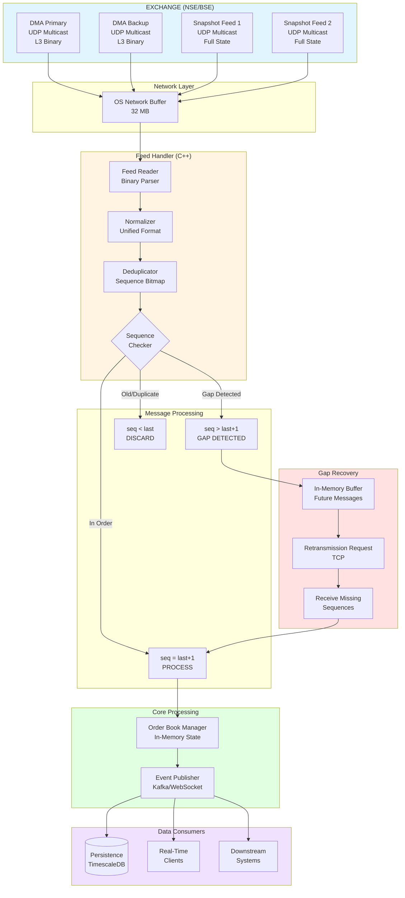

# Market Data Ingestion Module

## Architecture Flow Diagram

## System Assumptions

### Feed Configuration
- **1 PRIMARY DMA feed + 1 BACKUP DMA feed**: Level 3 (order-by-order), binary protocol, UDP multicast
- **2 SNAPSHOT feeds**: Complete order book state delivered every 1-5 seconds, L2/L3 data, UDP multicast
- **Retransmission channel**: TCP unicast for reliable message recovery
- **Order placement channel**: TCP for order submission/modification (separate from data ingestion)

### Buffer Strategy
- **In-memory buffers (RAM)**: For handling short-term gaps (milliseconds to seconds)
- **Disk buffers (SSD)**: For extended gaps or memory buffer overflow conditions

---

## Happy Path Flow

The standard processing flow for incoming market data:

1. **Receive** binary L3 data from PRIMARY DMA feed via fiber optic connection (UDP multicast)
2. **Store** in large OS network buffer (32 MB capacity to prevent overflow)
3. **Normalize** to common internal struct format
4. **Deduplicate** by checking sequence number:
   - Already processed → Discard
   - New sequence → Continue to next step
5. **Check sequence order**:
   - `seq = last + 1` → Process immediately (in-order message)
   - `seq > last + 1` → Buffer message (gap detected)
   - `seq < last` → Discard (duplicate or old message)
6. **Apply** changes to order book
7. **Publish** to downstream systems

---

## Normalization

### Purpose
Convert all feed formats (DMA Primary, DMA Backup, Snapshot 1, Snapshot 2) into a single unified internal struct.

### Benefits
- **Uniform processing**: All downstream components see consistent data structure
- **Easy failover**: Seamless switching between feed sources
- **Simplified logic**: Single code path for all feed types

---

## Deduplication

### When Duplicates Occur
- Backup DMA feed sends same sequence as primary
- Retransmission of already-received messages
- Late packet arrival after timeout

### Implementation
- **Method**: Track last 100,000 sequence numbers in a bitmap
- **Memory footprint**: 12 KB
- **Process**: Check bitmap before processing; discard if sequence already seen

---

## Gap Handling

### Common Causes
- Network packet loss (most frequent)
- OS buffer overflow due to insufficient capacity
- Network Interface Card (NIC) packet drops
- Application processing bottleneck (CPU-bound)

### Recovery Process

1. **Detect gap**: Identify sequence number jump
2. **Buffer future messages**: Store arriving messages in memory
3. **Send retransmission request**: Request missing sequences via TCP channel
4. **Continue buffering**: Keep storing incoming messages during recovery
5. **Receive missing sequences**: Obtain gap-fill data from exchange
6. **Process in order**: Apply missing messages → buffered messages → resume live stream
7. **Resume normal operation**: Return to real-time processing

### Prevention Strategies

**Network Layer**:
- Large OS socket buffers (32 MB via `SO_RCVBUF`)
- Increased NIC ring buffer size (4096 entries)
- Redundant network paths for failover
- Quality of Service (QoS) configuration on network switches

**System Layer**:
- CPU core pinning (dedicate specific cores to feed handling)
- Kernel bypass technologies (DPDK, Solarflare EF_VI)

---

## DMA Failover

### DMA to Snapshot Transition

**Trade-offs**:
- Increased latency (5 seconds vs microseconds)
- Periodic updates only (miss intermediate state changes)
- Final state only (lose order-level granularity)
- Potential loss of Level 3 order detail

**Acceptable Use Cases**:
- Non-critical market hours (pre-market, post-market)
- Temporary outages during DMA reconnection
- Better than complete data blackout

**Process**:
- Load most recent snapshot as current state
- Either discard old state OR request retransmission to fill gap

### Snapshot to DMA Reconnection

1. Obtain sequence number from latest snapshot
2. Request retransmission for missing sequence range
3. Replay missing sequences to rebuild complete history
4. Resume normal DMA processing

---

## Mixing Two DMA Feeds

### Operating Mode
**Active-Active**: Both primary and backup feeds running simultaneously

### Selection Strategy
- Accept message from **first feed to arrive**
- Deduplicate by sequence number (discard slower duplicate)
- Automatic failover with no manual intervention required

### Benefits
- **Zero failover delay**: Both feeds already operational
- **Path redundancy**: Survives single network path failure
- **Performance optimization**: Always uses fastest available path

---

## UDP Multicast Protocol

### Performance Advantages

1. **No acknowledgment overhead**: Fire-and-forget transmission model
2. **No retransmission delay**: No waiting for timeout detection
3. **No head-of-line blocking**: Each packet processed independently
4. **Network-level duplication**: One send reaches multiple receivers simultaneously
5. **Latency improvement**: 50 μs typical latency vs 200 μs for TCP (4x faster)

### Ideal Use Case
High-throughput broadcast data where:
- All clients receive identical data
- Microsecond latency requirements
- Occasional packet loss is acceptable (recovered separately)

### Reliability Handling
Packet loss and retransmission managed via dedicated TCP unicast channel, separating speed-critical path from reliability concerns.

---

## Performance Characteristics

| Metric | Target Value |
|--------|-------------|
| Message Latency | < 100 microseconds |
| Throughput | 1M+ messages/second |
| Gap Recovery Time | < 50 milliseconds |
| Memory Buffer | 32 MB per feed |
| Deduplication Overhead | < 10 nanoseconds per message |

---

## Technology Stack

**Hot Path (Ultra-low latency)**:
- C++ for feed handling and order book management
- Lock-free data structures for concurrency
- Zero-copy message processing

**Cold Path (Non-latency critical)**:
- Python for historical API and administrative functions
- TimescaleDB/ClickHouse for time-series storage

---
