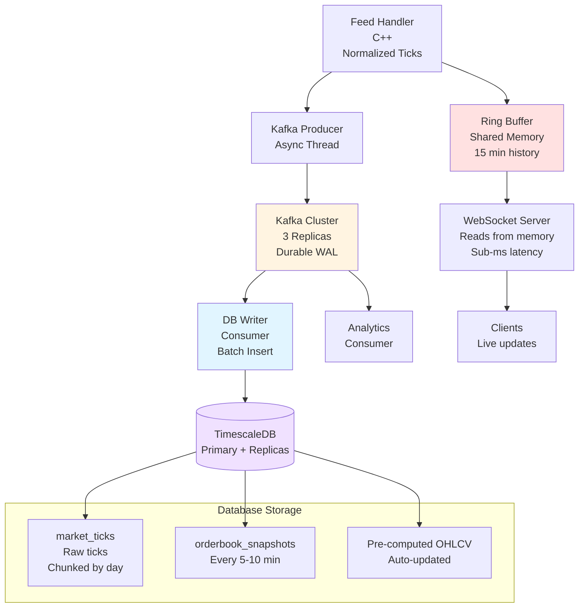

# Data Persistence Module

## Architecture Diagram



---

## What It Does

Store all market data permanently for compliance, analysis, and replay. Writes tick data to database and maintains pre-computed aggregates for fast queries.

---

## Data Flow

### Dual Path (Speed + Durability)

**Hot Path (WebSocket - Ultra-Fast):**
```
Feed Handler → Ring Buffer (Shared Memory) → WebSocket Server → Clients
Time: Sub-millisecond (nanoseconds)
Why: WebSocket needs real-time data, can't wait for Kafka latency
```

**Durable Path (Persistence - Safe):**
```
Feed Handler → Kafka Producer (Async) → Kafka (Replicated) → DB Writer → TimescaleDB
Time: 1-2ms for Kafka, then batch write to DB
Why: Kafka survives crashes, can replay if needed
```

**Key Point:** Feed Handler writes to BOTH simultaneously:
1. Writes to ring buffer (instant, for WebSocket)
2. Publishes to Kafka async (durable, for persistence)

### Why This Split?

**WebSocket reads from Ring Buffer (not Kafka):**
- Latency: < 1ms (vs 2-5ms with Kafka)
- Direct memory access (no network, no serialization)
- Critical for live trading

**Kafka for Persistence (not Ring Buffer):**
- Ring buffer lost on crash (in RAM)
- Kafka survives crashes (replicated on disk)
- Can replay if DB write fails
- Distributes to other services

### Data Structures Used

**Ring Buffer (Shared Memory) - For WebSocket:**
- Circular array in shared memory
- Multiple readers (10K+ WebSocket clients)
- Items never removed, overwritten when full
- Size: 15 minutes of data (~20 GB)
- Access: Nanoseconds (direct memory)
- Use: WebSocket backfill and live reads

**Kafka Producer Queue (Async) - For Persistence:**
- Internal queue in Feed Handler
- Batches messages before sending to Kafka
- Non-blocking (doesn't slow down Feed Handler)
- Size: Small buffer (10K-100K messages)
- Use: Async publish to Kafka

**Why This Design:**
```
Feed Handler receives tick:
├─ Write to ring buffer (50 nanoseconds) → WebSocket reads
└─ Queue for Kafka (100 nanoseconds) → Async thread publishes

Total overhead: 150 nanoseconds (negligible!)
WebSocket gets data: Sub-millisecond
Kafka gets data: 1-2 milliseconds (async, doesn't block)
```

| Feature | Ring Buffer (This System) | Kafka (This System) |
|---------|---------------------------|---------------------|
| **Location** | Shared memory (RAM) | Distributed cluster (Disk) |
| **Speed** | Nanoseconds | Milliseconds |
| **Durability** | Lost on crash | Survives crashes |
| **Readers** | Multiple (10K+ WebSocket clients) | Multiple consumers |
| **Size** | 15 minutes (~20 GB) | Days/weeks (unlimited) |
| **Use** | WebSocket real-time & backfill | Database persistence |
| **Latency** | Sub-millisecond | 1-5 milliseconds |
| **Replication** | Single server | 3 brokers |

### Architecture Decision

**Use BOTH together:**

```
Feed Handler
    ↓
    ├─→ Ring Buffer (Shared Memory)
    │   └─→ WebSocket Server (fast reads, < 1ms)
    │
    └─→ Kafka (Async, durable)
        ├─→ DB Writer (persistence)
        └─→ Analytics (other consumers)

Benefits:
✓ WebSocket: Ultra-fast (< 1ms latency)
✓ Persistence: Safe (Kafka survives crashes)
✓ Feed Handler: Not blocked (async Kafka publish)
✓ Scalable: Can add more consumers to Kafka
```

---

## Fault Tolerance (Never Lose Data)

### How We Survive System Failures

**1. Kafka as Write-Ahead Log**
```
Feed Handler publishes to Kafka first (not DB directly)
Kafka stores message on 3 brokers (replicated)
Even if Feed Handler crashes: Data safe in Kafka
Even if DB Writer crashes: Data safe in Kafka
Can replay from Kafka after recovery
```

**2. Kafka Replication**
```
Replication Factor: 3
- Broker 1: Leader (writes here)
- Broker 2: Follower (replica)
- Broker 3: Follower (replica)

If Broker 1 dies: Broker 2 becomes leader instantly
Message acknowledged only after 2 replicas confirm
Result: Never lose data even if 1 broker dies
```

**3. Database Replication**
```
Primary DB: All writes
Read Replica 1: Async replication (lag < 100ms)
Read Replica 2: Async replication
Read Replica 3: Async replication

If Primary dies: Promote replica to primary
Recent writes (last 100ms) might be lost from DB
But: Safe in Kafka! Replay from Kafka to new primary
```

**4. Consumer Offset Tracking**
```
DB Writer tracks: Last processed Kafka offset
Stored in: Database + Kafka itself
On restart: Resume from last committed offset
Never process same message twice
Never skip messages
```

**5. Transaction Safety**
```
DB Writer process:
1. Read batch from Kafka (1000 messages)
2. Begin database transaction
3. Bulk insert all 1000 rows
4. Commit transaction
5. Commit Kafka offset (mark as processed)
6. If any step fails: Rollback, retry from same offset

Result: Exactly-once processing
```

### Disaster Scenarios

**Scenario 1: Feed Handler Crashes**
- Impact: No new data published to Kafka
- Recovery: Restart Feed Handler, reconnect to exchange, request retransmission for gap
- Data loss: None (Kafka has everything published before crash)

**Scenario 2: DB Writer Crashes**
- Impact: Data piling up in Kafka (not written to DB)
- Recovery: Restart DB Writer, resume from last offset
- Data loss: None (Kafka retains data for days)

**Scenario 3: Kafka Broker Dies**
- Impact: Automatic failover to replica (< 1 second)
- Recovery: Replace failed broker, auto-replicates
- Data loss: None (replicated to 2 other brokers)

**Scenario 4: Database Crashes**
- Impact: Writes fail, data accumulates in Kafka
- Recovery: Start database, replay from Kafka
- Data loss: None (Kafka has everything)

**Scenario 5: Entire Datacenter Fails**
- Impact: All services down
- Recovery: Bring up in new datacenter, replay from Kafka
- Data loss: Only messages in-flight (< 1 second worth)
- Mitigation: Multi-region Kafka deployment

---

## What We Save

### 1. Raw Tick Data (Always)
```
Table: market_ticks
Data: Every DMA message (trades, orders, cancels)
Volume: ~2.7M rows/day per symbol
Size: ~150 GB/day uncompressed → 15-30 GB compressed
Retention: 2 years (configurable)
```

### 2. Order Book Snapshots (Periodic)
```
Table: orderbook_snapshots
Data: Full order book state every 5-10 minutes
Volume: ~60 GB/day uncompressed → 6 GB compressed
Why: Fast recovery without replaying millions of ticks
```

### 3. Pre-computed OHLCV Bars (Automatic)
```
Tables: ohlcv_1min, ohlcv_5min, ohlcv_1hour, ohlcv_1day
Data: Auto-computed from ticks using Continuous Aggregates
Volume: ~45 MB/day per interval
Why: Instant queries (5-20ms vs 200-500ms on-the-fly)
```

---

## Database Schema

### market_ticks
```
Columns:
- time (timestamptz) - When tick happened
- symbol_id (integer) - Which symbol
- price (bigint) - Fixed-point price
- quantity (integer) - Trade/order size
- side (char) - 'B' or 'S'
- message_type (smallint) - TRADE, ORDER_ADD, etc.
- order_id (bigint) - L3 order ID
- sequence_num (bigint) - For gap detection
- source (smallint) - DMA_PRIMARY, DMA_BACKUP, SNAPSHOT

Partitioning: By time (1 day chunks) + symbol (16 partitions)
Indexes: (symbol_id, time), (sequence_num)
Compression: After 7 days (10:1 ratio)
```

### Pre-computed Bars (Continuous Aggregates)
```
Auto-created and maintained by TimescaleDB
Updated every 1 minute in background
No manual intervention needed
Query them like regular tables
```

---

## Write Strategy

### Batch Writing
```
Don't write one tick at a time (slow!)
Buffer 1,000-10,000 ticks
Bulk INSERT in single transaction
Result: 100x faster (100K rows/sec vs 1K rows/sec)
```

### Compression Policy
```
After 7 days: Compress old chunks
Ratio: 10:1 (200 GB → 20 GB)
Query speed: Only 2-3x slower (still fast)
Saves: 90% disk space
```

### Retention Policy
```
After 2 years: Auto-delete old chunks
Execution: Instant (just drops files)
No table bloat, no slow DELETE queries
```

---

## Why TimescaleDB?

### Chunk Exclusion
Query for 1 day from 1 year of data → Scans only 1/365 of data (365x faster).

### Continuous Aggregates
Pre-computed OHLCV views auto-maintained. No manual jobs needed.

### Compression
Native columnar compression. 90% space savings.

### Time-series Optimized
Built for time-range queries. 30-100x faster than regular PostgreSQL.

---

## Performance

| Operation | Speed |
|-----------|-------|
| Write (batched) | 100K rows/sec |
| Query ticks (1 day) | 10-50ms |
| Query OHLCV (pre-computed) | 5-20ms |
| Query OHLCV (on-the-fly) | 200-500ms |
| Compression ratio | 10:1 |

---

## Design Decisions

### Kafka as Primary Buffer (Not In-Process Queue)
Kafka acts as durable Write-Ahead Log. Trade-off: Adds 1-2ms latency but prevents data loss on crashes.

### TimescaleDB vs ClickHouse
TimescaleDB for balance of speed and features. Trade-off: ClickHouse faster for analytics but no updates.

### Batch Size (1000-10000 rows)
Sweet spot for throughput. Trade-off: Slight delay (10-100ms) before data persisted.

### Pre-compute Common Intervals
1min, 5min, 1hour, 1day pre-computed. Trade-off: 45 MB/day storage per interval.

### Compression After 7 Days
Balance query speed and storage. Trade-off: Compressed data 2-3x slower to query (but still fast).

---

## Tech Stack

- **Durable Buffer:** Kafka (3 brokers, 3 replicas per topic)
- **Database:** TimescaleDB (primary + 3 read replicas)
- **Writer:** C++ consumer with batch insert (1000-10000 rows)
- **Connection Pool:** 20-100 database connections
- **Compression:** TimescaleDB native columnar (10:1 ratio)
- **Partitioning:** Kafka topics by symbol hash, DB by time + symbol

---

## Scaling

### Vertical
- SSD/NVMe for fast writes
- 256+ GB RAM for caching
- Connection pool (20-100 connections)

### Horizontal
- Read replicas (3) for queries
- Kafka partitioning by symbol
- Shard database by symbol range if needed

---

## Summary

### Complete Data Flow
```
Exchange → Feed Handler
              ↓
              ├─→ Ring Buffer (Shared Memory) → WebSocket (< 1ms)
              │
              └─→ Kafka Producer (Async) → Kafka (Replicated)
                                               ↓
                                          ┌────┴────┐
                                          ↓         ↓
                                     DB Writer  Analytics
                                          ↓
                                    TimescaleDB
```

### Why This Architecture

**Hot Path (WebSocket):**
- Reads from ring buffer in shared memory
- Latency: Sub-millisecond (nanoseconds)
- No Kafka overhead for real-time data

**Durable Path (Persistence):**
- Kafka as Write-Ahead Log
- Async (doesn't slow Feed Handler)
- Survives crashes, enables replay

### Zero Data Loss Strategy
1. **Kafka as WAL:** All ticks written to Kafka first (replicated 3x)
2. **Consumer offsets:** Track exactly what's been written to DB
3. **Transactions:** All-or-nothing writes to database
4. **DB replication:** Primary + 3 replicas for availability
5. **Replay capability:** Can reprocess from Kafka if needed

### Key Points
- **Kafka first, DB second:** Kafka is source of truth
- **Exactly-once processing:** Never lose, never duplicate
- **Pre-computed OHLCV:** Fast queries without recomputation
- **Compression:** Save 90% storage after 7 days
- **Automated:** Compression, aggregation, retention all automatic

**Result:** 100K writes/sec, zero data loss, 5-50ms queries, 2 years retention.

