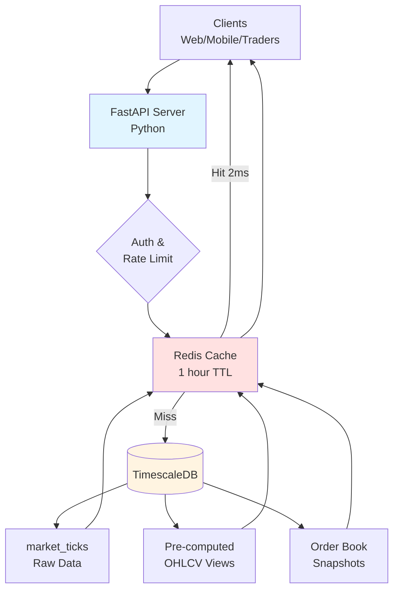

# Historical API Server

## Architecture Diagram



---

## What It Does

REST API for querying past market data. Clients make HTTP requests, get JSON responses with historical ticks, charts, or order books.

**Not for real-time trading** - use WebSocket for that. This is for analysis, backtesting, and reports where 10-500ms latency is fine.

---

## API Endpoints

### 1. Get Tick Data
```
GET /api/v1/ticks/{symbol}?start=TIME&end=TIME&limit=1000

Returns: Raw tick-by-tick trades and orders
Speed: 10-50ms
Use: Detailed analysis, audit trails, debugging
```

### 2. Get OHLCV Bars (Single)
```
GET /api/v1/ohlcv/{symbol}?interval=1min&start=TIME&end=TIME

Returns: Candlestick bars (Open, High, Low, Close, Volume)
Speed: 5-20ms (pre-computed) or 200-500ms (custom intervals)
Use: Charts, technical analysis, backtesting
```

### 3. Get OHLCV Bars (Batch)
```
POST /api/v1/ohlcv/batch
Body: {"symbols": ["RELIANCE", "TCS", ...], "interval": "1min"}

Returns: Multiple symbols in one request
Speed: 50-100ms for 50 symbols
Use: Market dashboards, multi-symbol analysis
```

### 4. Get Order Book
```
GET /api/v1/orderbook/{symbol}?timestamp=TIME&depth=5

Returns: Bid/ask levels at specific time
Speed: 5-10ms
Use: Liquidity analysis, market depth study
```

### 5. Search Symbols
```
GET /api/v1/symbols/search?query=RELI

Returns: Symbol information and metadata
Speed: 2-10ms
Use: Auto-complete, symbol discovery
```

### 6. Export Data
```
GET /api/v1/export/{symbol}?format=parquet&compression=gzip

Returns: Bulk data download (file)
Use: ML training, offline research
```

---

## How OHLCV Works

### Pre-computed Bars (Fast)
- Bars calculated in advance, stored in database
- Intervals: 1min, 5min, 15min, 1hour, 1day
- Speed: 5-20ms
- Auto-updated every minute
- Covers 95% of requests

### On-the-Fly Bars (Flexible)
- Bars calculated when requested
- Any custom interval (7min, 33min, etc.)
- Speed: 200-500ms
- No storage needed
- For special cases

**API automatically picks the right method based on interval requested.**

---

## Optimizations

### 1. Redis Caching
Popular queries cached in memory. First request: 50ms, cached: 2ms. 25x speedup.

### 2. Connection Pooling
Reuse database connections instead of creating new ones. Saves 50ms per request.

### 3. Batch Queries
Query 50 symbols together, not one-by-one. 50x20ms = 1000ms → Single query 50ms = 20x faster.

### 4. Database Indexing
Indexes on (symbol, time) for fast lookups. 10-50x faster queries.

### 5. Chunk Exclusion
TimescaleDB only scans relevant day's data. Query 1 day from 1 year = scan 1/365 of data.

### 6. Symbol Partitioning
Different symbols stored in different partitions. Parallel scanning for multiple symbols.

### 7. Async I/O
Non-blocking requests. Handle 1000s of concurrent queries efficiently.

---

## Performance

| Query Type | Response Time | Cached |
|------------|---------------|--------|
| Ticks (1 day) | 10-50ms | N/A |
| OHLCV pre-computed | 5-20ms | 2ms |
| OHLCV custom | 200-500ms | 2ms |
| Batch (50 symbols) | 50-100ms | 2-5ms |
| Order book | 5-10ms | 1ms |
| Symbol search | 2-10ms | 1ms |

**Throughput:** 1000s requests/second with caching and load balancing.

---

## Design Decisions

### Python vs C++
**Chose Python** - Fast enough (10-500ms OK), easier development, rich libraries. Trade-off: Slower than C++ but doesn't matter here.

### Pre-compute vs On-Demand
**Chose Both** - Pre-compute common intervals (fast), compute rest on-demand (flexible). Trade-off: 45 MB/day storage per interval.

### REST vs GraphQL
**Chose REST** - Simpler, better caching, wider support. Trade-off: Less flexible response structure.

### Sync vs Async
**Chose Async** - Better throughput, efficient resources. Trade-off: More complex code.

---

## Technology Stack

- **API Framework:** FastAPI (async, auto-docs, fast)
- **Language:** Python 3.11+
- **Database:** TimescaleDB (time-series optimized PostgreSQL)
- **Cache:** Redis (in-memory, fast)
- **Auth:** JWT tokens
- **Rate Limiting:** Redis sliding window
- **Server:** Uvicorn (ASGI server)

---

## Security

**Authentication:** JWT tokens in request headers  
**Rate Limits:** Free (100/min), Pro (1000/min), Enterprise (unlimited)  
**Access Control:** Users can only query allowed symbols

---

## Scalability

- Multiple API servers behind load balancer
- Database with 3 read replicas for queries
- Redis cluster for distributed caching
- Can handle 10,000+ requests/second

---

## Summary

**Historical API Server = Gateway to past market data**

- 6 endpoints for different needs
- 5-500ms response times (fast enough)
- Redis caching for 25x speedup
- Pre-computed bars for speed, on-demand for flexibility
- Secure with auth and rate limiting
- Scales horizontally

Built for **analysis and backtesting**