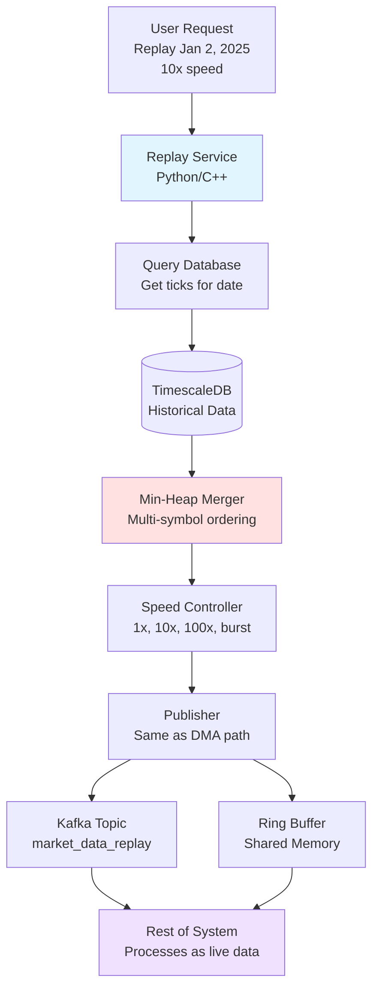

# Replay Service

## Architecture Diagram



---

## What It Does

Replay historical market data as if it's happening live. Test trading strategies, debug issues, or train users on past market days.

---

## How It Works

### Basic Flow
```
1. User: "Replay Jan 2, 2025 at 10x speed"
2. Query database for all ticks on that date
3. Merge multiple symbols in correct time order (min-heap)
4. Send at 10x speed with proper delays
5. Publish through same path as live DMA
6. System processes it as live data (doesn't know it's replay)
```

---

## Key Features

### 1. Replay Any Past Day

Query database for specific date and symbols. Stream data from database cursor (don't load all into memory).

```
Example: Replay Jan 2, 2025, RELIANCE + TCS
- Query: All ticks for these symbols on this date
- Result: 2 database cursors (one per symbol)
- Stream: Fetch 10K ticks at a time
```

---

### 2. Variable Speeds

**1x Speed (Real-time):**
- 6h 15min of data takes 6h 15min to replay
- Use: Realistic testing

**10x Speed:**
- 6h 15min takes 37.5 minutes
- Use: Faster backtesting

**100x Speed:**
- 6h 15min takes 3.75 minutes
- Use: Very fast backtesting

**Burst Mode:**
- Send as fast as possible (~1M msgs/sec)
- 6h 15min takes ~60 seconds
- Use: Maximum speed

---

### 3. Correct Ordering (Min-Heap)

**Problem:** Replay RELIANCE + TCS together. How to merge in correct time order?

**Solution:** Min-heap (priority queue) ordered by timestamp

```
Algorithm:
1. Read first tick from each symbol
2. Put all in min-heap (ordered by time)
3. Pop earliest tick from heap
4. Send that tick
5. Read next tick from same symbol
6. Push back to heap
7. Repeat until done

Result: Always sends earliest tick across all symbols!

Complexity: O(log N) per tick where N = number of symbols
Example: 50 symbols = 6 operations per tick (very fast)
```

**Example:**
```
Heap: [RELIANCE@09:15:00.001, TCS@09:15:00.002]

Step 1: Pop RELIANCE@09:15:00.001 (earliest) → Send
        Read next RELIANCE → Push to heap
Heap: [TCS@09:15:00.002, RELIANCE@09:15:00.003]

Step 2: Pop TCS@09:15:00.002 → Send
        Read next TCS → Push to heap
Heap: [RELIANCE@09:15:00.003, TCS@09:15:00.005]

Continue...
```

---

### 4. Same Path as DMA

**Normal Live:**
```
Exchange → DMA Feed → Feed Handler → System
```

**Replay Mode:**
```
Database → Replay Engine → Simulated DMA → Feed Handler → System
                              ↑
                    (Looks like real DMA!)
```

**Key:** Publishes to same Kafka topic or shared memory as live DMA. Rest of system can't tell it's replayed data.

**Benefits:**
- Test entire system end-to-end
- No special "replay mode" in other components
- If works in replay, works in production

---

## Speed Control

### Implementation
```
For each tick:
1. Calculate market time elapsed = tick.time - first_tick.time
2. Calculate replay time = market_elapsed / speed
3. Target send time = replay_start + replay_time
4. Sleep until target time
5. Send tick

Example (10x speed):
- Market: 09:15:00.000 to 09:15:01.000 (1 second)
- Replay: Send in 0.1 seconds (10x faster)
```

### Burst Mode
```
No sleep at all
Send ticks as fast as possible
Limited only by:
- Network bandwidth
- Kafka throughput
- CPU speed
Result: ~1M messages/second
```

---

## Performance

| Speed | 6h 15min replay time | Use Case |
|-------|---------------------|----------|
| 1x | 6h 15min | Realistic testing |
| 10x | 37.5 minutes | Standard backtesting |
| 100x | 3.75 minutes | Fast backtesting |
| Burst | ~60 seconds | Maximum speed testing |

**Throughput:**
- 10x speed: ~150K msgs/sec
- 100x speed: 1.5M msgs/sec
- Burst: Limited by network/Kafka (~1M msgs/sec)

---

## Design Decisions

### Python + C++ Hybrid
Python for orchestration and DB queries. C++ for replay engine core (100x and burst need tight timing). Trade-off: More complex but necessary for speed.

### Min-Heap for Ordering
Ensures perfect multi-symbol time order. Trade-off: O(log N) overhead per tick (but N is small, ~50 symbols).

### Stream from Database
Don't load entire day into memory. Stream in 10K-50K batches. Trade-off: More DB queries but manageable memory.

### Same Path as DMA
Publishes to production Kafka topics/ring buffer. Trade-off: Must be careful not to mix with live data (use separate topics for safety).

---

## Tech Stack

- **Orchestration:** Python (FastAPI for API, asyncpg for DB)
- **Replay Engine:** C++ (tight timing control for high speeds)
- **Database:** TimescaleDB (time-range queries optimized)
- **Ordering:** Min-heap (std::priority_queue or heapq)
- **Publisher:** Kafka producer or shared memory writer
- **Batch Size:** 10K-50K ticks per fetch

---

## Use Cases

**Backtesting:**
- Test trading strategy on historical data
- See if algo would have been profitable
- Optimize parameters

**Debugging:**
- Reproduce issue that happened on specific day
- Step through with debugger
- Analyze what went wrong

**Training:**
- Show traders how market behaved
- Practice trading on historical days
- Learn market patterns

**Load Testing:**
- Test if system can handle peak loads
- Stress test with burst mode
- Find bottlenecks

---

## Advanced Features

**Pause/Resume:**
- Pause replay at any point
- Save position (timestamp + offset)
- Resume from same position later

**Seek:**
- Jump to specific time (e.g., 11:30 AM)
- New database query from that time
- Continue replay from there

**Multi-Day:**
- Replay entire week (5 trading days)
- Seamlessly transition between days
- Continuous stream

---

## Summary

Replay historical market data as if it's live. Query database, merge symbols in correct time order (min-heap), control playback speed (1x to burst), publish through same path as DMA.

**Core algorithm:** Min-heap ensures perfect multi-symbol ordering.

**Key benefit:** Test entire system end-to-end with realistic historical data.

Built for **backtesting, debugging, and training** where realistic timing matters.

