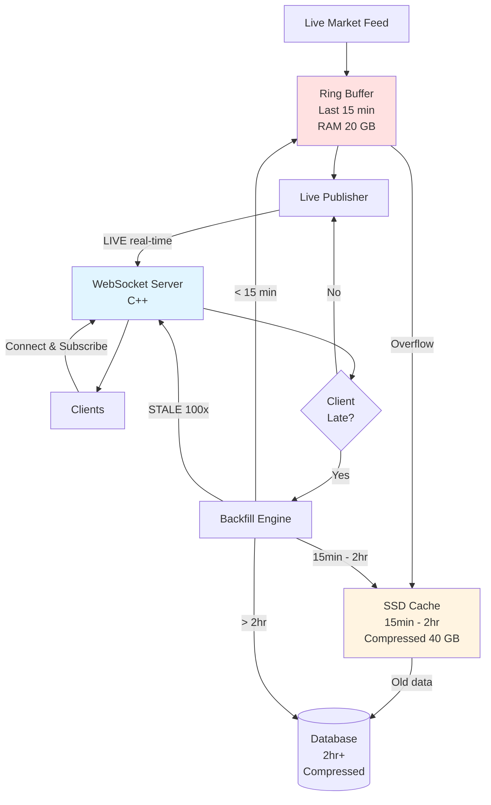

# Real-Time WebSocket Publisher

## Architecture Diagram



---

## What It Does

Push live market data to clients via WebSocket. If client connects late, send missed data fast (backfill), then switch to real-time.

---

## How It Works

### Connection Flow
```
1. Client connects at 10:30 AM (market started 9:15 AM)
2. Client subscribes to RELIANCE, TCS
3. Server detects: Client is 1h 15min late
4. Backfill: Send 9:15-10:30 data at 100x speed (marked "STALE")
5. Takes 45 seconds to catch up
6. Switch to real-time (marked "LIVE")
7. Client has full history + live updates
```

### Message Format
```json
Backfill: {"symbol": "RELIANCE", "price": 2450.50, "status": "STALE"}
Live: {"symbol": "RELIANCE", "price": 2452.50, "status": "LIVE"}
```

---

## Key Components

### Tiered Storage (Smart!)

**Tier 1: Ring Buffer (Hot - Memory)**
- Last 15 minutes in RAM
- Size: 20 GB uncompressed
- Access: Instant (nanoseconds)
- Covers: 90% of clients

**Tier 2: SSD Cache (Warm - Compressed)**
- 15 minutes to 2 hours
- Size: 40 GB compressed (5:1 ratio)
- Access: Fast (1-5ms)
- Covers: 9% of clients

**Tier 3: Database (Cold - Compressed)**
- Older than 2 hours
- Size: Unlimited, highly compressed
- Access: 10-50ms
- Covers: 1% of clients

### Backfill Engine
- Speed: 100x real-time (1 hour in 36 seconds)
- Source: Checks Tier 1 → Tier 2 → Tier 3
- Decompresses on-the-fly if needed (adds 10-50 microseconds)
- Marks all as "STALE"

**Why tiered approach is better:**
- **Saves RAM:** 15 min vs 2 hours (20 GB vs 160 GB saved)
- **Compression:** SSD stores 2 hours compressed to 40 GB (from 160 GB uncompressed)
- **Cost-effective:** 1 TB SSD = $100, 1 TB RAM = $10,000 (100x cheaper!)
- **Performance:** 90% instant, 9% fast (1-5ms), 1% acceptable (10-50ms)
- **Scalable:** Can extend to 8+ hours on SSD easily

### Live Publisher
- Broadcasts ticks as they arrive
- Latency: Sub-10ms
- Marks data as "LIVE"

---

## Performance

| Metric | Value |
|--------|-------|
| Live latency | < 5ms |
| Backfill speed | 100,000 msgs/sec |
| Concurrent clients | 10,000+ per server |
| Memory usage | 30 GB (20 GB buffer + 10 GB connections) |

---

## Design Decisions

### C++ for Server
Fast enough for sub-10ms latency. Trade-off: Harder to code than Python.

### Tiered Storage (15 min RAM + 2 hr SSD + DB)
Best balance of speed and cost. Trade-off: Adds decompression overhead (10-50 microseconds) for SSD tier.

### 100x Backfill Speed
1 hour in 36 seconds. Trade-off: Some slow clients might struggle.

### JSON Messages
Easy to use and debug. Trade-off: 3x larger than binary.

---

## Tech Stack

- **Language:** C++ (low latency)
- **WebSocket:** uWebSockets or Boost.Beast
- **Ring Buffer:** Lock-free circular array
- **Data Source:** Shared memory from Feed Handler
- **Fallback:** TimescaleDB for old data

---

## Client Behavior

**During STALE (backfill):**
- Batch process 1000 messages at once
- Show loading progress
- Build state silently

**During LIVE (real-time):**
- Process each tick immediately
- Update UI and trigger alerts

---

## Summary

WebSocket server that pushes live market data with fast backfill for late clients. Sub-10ms latency, handles 10K+ clients, marks historical vs live data clearly.

Built for **live trading** where speed matters.

